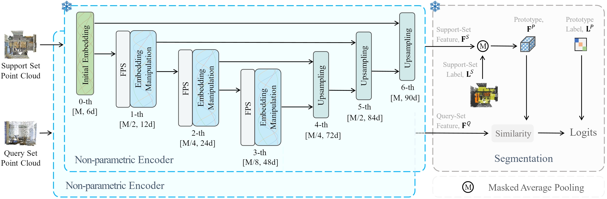

# Less is More: Towards Efficient Few-shot 3D Semantic Segmentation via Training-free Networks


## Introduction
we propose an efficient **T**raining-free **F**ew-shot 3D **S**egmentation netwrok, TFS3D, and a further training-based variant, TFS3D-T. TFS3D introduces no learnable parameters and and requires no training. Specifically, TFS3D extracts dense representations by trigonometric positional encodings and achieves comparable performance to some training-based methods. Building upon TFS3D, TFS3D-T only requires to train a lightweight query-support transferring attention (QUEST), which enhances the interaction between the few-shot query and support data.




## Requirements
### Installation
Create a conda environment and install dependencies:
```bash
cd TFS3D

conda create -n TFS3D python=3.7
conda activate TFS3D

# Install the according versions of torch and torchvision
conda install pytorch torchvision cudatoolkit

pip install -r requirements.txt
pip install pointnet2_ops_lib/.
```

### Datasets

**Installation and data preparation please follow [attMPTI](https://github.com/Na-Z/attMPTI).**


### TFS3D

TFS3D does not require any training and can conduct few-shot segmentation directly via:

```bash
bash scripts/training_free.sh
```

### TFS3D-T

Train and test our method under few-shot setting:

```bash
bash scripts/training.sh
```

The test procedure has been included in the above command after training and validation.


Note that the above scripts are used for 2-way 1-shot on S3DIS (S_0). Please modify the corresponding hyperparameters to conduct experiments on other settings. 


## Acknowledgement
We thank [Point-NN](https://github.com/ZrrSkywalker/Point-NN/tree/main), [PAP-FZS3D](https://github.com/heshuting555/PAP-FZS3D), and [attMPTI](https://github.com/Na-Z/attMPTI) for sharing their source code.
